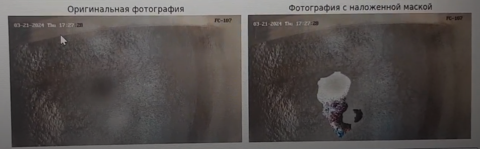
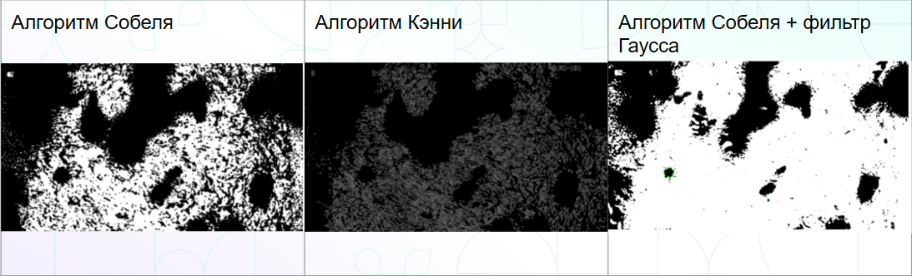

# Определение факта загрязнения камеры.
---

* Загрязненные линзы камер могут серьезно повлиять на качество работы алгоритмов компьютерного зрения. В этой задаче необходимо разработать метод определения степени загрязнения кадра, чтобы обеспечить надежную работу камер на производстве. Решение этой проблемы поможет повысить точность и эффективность различных систем, зависящих от визуальных данных.
---
# Установка и запуск проект
* В файле requirements.txt указаны все нужные зависимости. Для работы также нужен Python ~3.10. Чтобы запустить обучение и получить рабочую модель достаточно найти файл, располагающийся по этому пути *train_dataset/baseline/main.ipynbtrain_dataset/baseline/main.ipynb* и воспользовавшись окружением, умеющим воспроизводить jupyter тетрадки для прогона всех блоков кода.
---
# Основной функционал проекта
* Основной функционал - предсказание маски загрязненной поверхности на линзе с камеры наблюдения. Так же предоставлен код для обучения нейросетевой модели. Предоставлены различные виды аугментации данных: добавление разных эффектов(дождь, тень, пыль и т.д.)
---
# Технологии и инструменты

  
  
  
  
  
  
  

---

# *Команда проекта*

1. [Карпов Назарий](https://github.com/nazar-karpov)  
   *ML-engineer, разработка пайплайна обучения и инференса модели.*

2. [Габрахманов Заман](https://github.com/choseenonee)  
   *ML-engineer, разработка пайплайна обучения и инференса модели.*

3. [Картаева Анна](https://github.com/kartaevana)  
   *ML-engineer, исследования и добавление фичей в инференс.*

4. [Соляник Варвара](https://github.com/var-solyanik)  
   *ML-engineer, исследования и добавление фичей в инференс.*

5. [Смирнов Павел](https://github.com/pshsmrnv)  
   *ML-engineer, исследования и добавление фичей в инференс.*

---

# Струтура проекта 

* *train_dataset/baseline/main.ipynb* - тетрадка для обучения модели
* *solution_docker* - докерффайл для запуска инференса модели на данных, которые к сожалению не удастся предоставить(организаторы запретили)
* *ideas* - папка с идеями для обнаружения загрязнений на камере. В частности, алгоритмы обнаружения границ пятен.
---

# Демонстрация работы проекта  
  
# Дополнение  
  

---
# Финальный текст-заключение  
Алгоритмы компьютерного зрения решают много задач на наших производствах. Если линза камеры загрязнена, то точность и корректность работы алгоритмов может очень сильно снизиться. Поэтому необходимо решение, отслеживающее загрязнение линз. Своевременное обнаружение загрязнений позволяет предотвратить ошибки в работе системы и повысить её надежность, обеспечивая точность данных для дальнейшей обработки и принятия решений.

